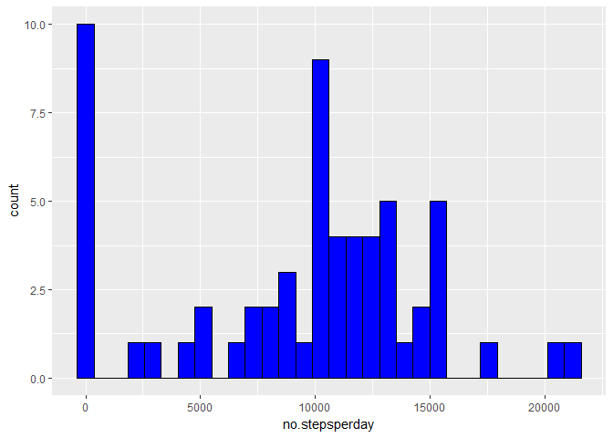

## Loading and preprocessing the data


## What is mean total number of steps taken per day?


## What is the average daily activity pattern?


## Imputing missing values


## Are there differences in activity patterns between weekdays and weekends?


## R Markdown Assignment

### Set working directory

Fork repo specified for the assignment. Clone the repo to desktop and change working directory


```r
setwd("C:/Users/mdon/Desktop/RepData_PeerAssessment1")
```

## Unzip files


```r
unzip("activity.zip", exdir = ".", unzip = "internal")
```

Load activity data into R


```r
Activity <- read.csv("activity.csv", header = TRUE, stringsAsFactors = FALSE)
```

Load lubridate package to convert character to date for date column.


```r
library(lubridate)
Activity$date <- ymd(Activity$date)
```

Calculate the total number of steps per day, counting NAs as 0


```r
library(tidyverse)
stepsperday <- Activity %>% group_by(date) %>% summarise(no.stepsperday=sum(steps, na.rm = TRUE))
```

Make a histogram of the total number of steps per day


```r
library(ggplot2)
ggplot(data = stepsperday,aes(no.stepsperday))+geom_histogram(bins=30,colour="black", fill="blue")
```

<!-- -->

Calculate the mean and median number of steps ignoring NA values

```r
mean(stepsperday$no.stepsperday, na.rm = TRUE)
```

```
## [1] 9354.23
```

```r
median(stepsperday$no.stepsperday, na.rm = TRUE)
```

```
## [1] 10395
```

Calculate the average number of steps per interval ignoring NA values


```r
inter <- split(Activity$steps,Activity$interval)
avstpsperinter <- sapply(inter,function(x){mean(x,na.rm = TRUE)})
dfavperinter <- as.data.frame(avstpsperinter)
dfavperinter <- cbind(dfavperinter,Interval = row.names(dfavperinter))
dfavperinter$Interval <- as.numeric(as.character(dfavperinter$Interval))
```

Plot the average number of steps per interval


```r
ggplot(data=dfavperinter, aes(x=Interval,y=avstpsperinter))+geom_line(color="red")+ylab("Average no. steps per interval")+ggtitle("Plot of average number of steps per 5minute time interval")
```

<!-- -->

Which 5-minute interval, on average across all the days in the dataset, contains the maximum number of steps?


```r
dfavperinter[dfavperinter$avstpsperinter == max(dfavperinter$avstpsperinter),2]
```

```
## [1] 835
```

Imputing missing values
Note that there are a number of days/intervals where there are missing values (coded as NA). The presence of missing days may introduce bias into some calculations or summaries of the data.

Calculate the number of missing values


```r
sum(is.na(Activity$steps))
```

```
## [1] 2304
```

Devise a strategy for filling in all of the missing values in the dataset. The strategy does not need to be sophisticated. For example, you could use the mean/median for that day, or the mean for that 5-minute interval, etc.

I will be replacing missing values with the average number of steps for that particular interval


```r
#Copy activity df

inputActivity <- Activity

#Change column names of inputactivity and dfavperinter so the interval columns are the same
colnames(dfavperinter) <- c("avstpsperinter", "interval")

#join data frames on interval column
inputActivity <- left_join(inputActivity,dfavperinter, by = "interval")

#Create new stepsfilled column in inputactivity dataframe. Whenever there is an NA replace with the average number of steps for that interval

inputActivity$stepsfilled <- ifelse(is.na(inputActivity$steps),inputActivity$avstpsperinter,inputActivity$steps)
```

Create a new dataset that is equal to the original dataset but with the missing data filled in.


```r
Newdataset <- data.frame(steps=inputActivity$stepsfilled,date=inputActivity$date, interval=inputActivity$interval)
```

Make a histogram of the total number of steps taken each day with the new data


```r
Newdataset %>% group_by(date) %>% summarise(no.stepsperday=sum(steps, na.rm = TRUE)) %>% ggplot(aes(no.stepsperday))+geom_histogram(bins=30,colour="black", fill="blue")
```

<!-- -->

Calculate and report the mean and median total number of steps taken per day with new data set

```r
Newnumberofsteps <- Newdataset %>% group_by(date) %>% summarise(no.stepsperday=sum(steps, na.rm = TRUE))
mean(Newnumberofsteps$no.stepsperday)
```

```
## [1] 10766.19
```

```r
median(Newnumberofsteps$no.stepsperday)
```

```
## [1] 10766.19
```

What is the difference between the new mean and the original mean calculated.

```r
(mean(Newnumberofsteps$no.stepsperday))-(mean(stepsperday$no.stepsperday, na.rm = TRUE))
```

```
## [1] 1411.959
```


What is the difference between the new median and the original median calculated.


```r
(median(Newnumberofsteps$no.stepsperday))-(median(stepsperday$no.stepsperday, na.rm = TRUE))
```

```
## [1] 371.1887
```

Both the mean and the median have increased with the missing data replaced with the average for the particular interval specified.

Convert new dataset date to date format

```r
Newdataset$date <- as.character(Newdataset$date)
Newdataset$date <- ymd(Newdataset$date)
str(Newdataset)
```

```
## 'data.frame':	17568 obs. of  3 variables:
##  $ steps   : num  1.717 0.3396 0.1321 0.1509 0.0755 ...
##  $ date    : Date, format: "2012-10-01" "2012-10-01" ...
##  $ interval: num  0 5 10 15 20 25 30 35 40 45 ...
```

##Are there differences in activity patterns between weekdays and weekends?

Add a new column specifying day of the week and a new column classifying the day typr - weekday or weekend.


```r
Newdataset$dayofweek <- weekdays(Newdataset$date)
Newdataset$WeekdayType <- ifelse(Newdataset$dayofweek %in% c("Saturday","Sunday"),"weekend", "weekday")
```

Make a panel plot containing a time series plot (i.e. type="l") of the 5-minute interval (x-axis) and the average number of steps taken, averaged across all weekday days or weekend days (y-axis).


```r
Avnewdataset <- aggregate(steps~interval+WeekdayType, data = Newdataset, mean)
ggplot(data=Avnewdataset, aes(x=interval,y=steps))+geom_line(color="red")+ylab("Average no. steps per interval")+facet_grid(WeekdayType~.)+ggtitle("Plot of average number of steps per 5minute time intervalsplit by weekend and weekday")
```

<!-- -->


